# Home Server Hosting

These sub-projects contain docker-compose files used to host servers on your home server(s) to:

-  Avoid paying for cloud services
-  Keep your data private
-  Run services even with no Internet

## Installation & Setup

1. **Start the Installer**
   Run the main installation script. This serves as a unified entry point for setting up your environment, configuring backups, and installing services.
   ```bash
   chmod +x install.sh
   ./install.sh
   ```

2. **Configuration Steps**
   The script will guide you through:
   - **Docker Root**: Where to store your service configuration and data (default: `~/docker_stacks`).
   - **Base DNS**: Domain for your services (e.g., `example.duckdns.org`).
   - **Backups**: 
     - Choose between backing up to a **Dedicated Backup Disk** (formatted automatically) or an **Existing Folder**.
     - Backups are automatically scheduled (defaults to daily at 03:00 AM).

3. **Service Selection**
   - You will be presented with a list of available services (e.g., Immich, Home Assistant, Nextcloud).
   - Select the services you want to install.

### Smart Backups
This project handles backups automatically for installed services.
- **Auto-Discovery**: When you install a service via `install.sh`, a dedicated backup script is generated for it in its directory (e.g., `immich/backup.sh`).
- **Context-Aware**:
  - Services with Databases (Postgres) get a script that dumps the DB + syncs files.
  - Other services get a smart Rsync backup.
- **Master Schedule**: All active services are added to a master backup schedule (`backup/master-backup.sh`).

### Adding More Services Later
Want to install another service later? Just run `./install.sh` again!
- It detects your existing configuration.
- It asks if you want to use the existing settings.
- It skips directly to the service selection menu so you can add new apps quickly.

### Restoring Data (Legacy Support)
Some services support importing config from previous installations:
1. Copy your config folders to the local `backup` folder.
2. Go into the specific service folder & run `restore-from-backup.sh` (if available).
This is supported for: `headscale`, `nginx-reverse-proxy`.

## Services

| Service             | Description                                            |
| ------------------- | ------------------------------------------------------ |
| [Docmost](https://docmost.com/)             | Self-hosted documentation/wiki platform                |
| [Glance Dashboard](https://github.com/glanceapp/glance)    | Customizable dashboard/monitoring                      |
| [Headscale](https://headscale.net/stable/)           | Self-hosted Tailscale secure network server (like VPN) |
| [Home Assistant](https://www.home-assistant.io/)      | Home automation platform                               |
| [Immich](https://immich.app/)              | Self-hosted photo & video backup                       |
| Linux-in-Docker     | Lightweight Linux desktop in Docker with Web UI        |
| [Nextcloud](https://nextcloud.com/)           | File sync and collaboration suite                      |
| [Nginx Reverse Proxy](https://nginxproxymanager.com/) | Reverse proxy for web services                         |
| [Ollama LLM server](https://ollama.com/)   | Local LLM (AI) server                                  |
| [Open WebUI for Ollama](https://github.com/open-webui/open-webui)   | Web interface for Ollama LLM                           |
| [Portainer](https://portainer.io/)           | Docker management srv OR Agent                         |
| Registry           | Local Docker registry                         |
| [Traccar](https://traccar.org/)             | GPS tracking platform                                  |
| [Vaultwarden](https://github.com/dani-garcia/vaultwarden)         | Self-hosted password manager                           |
| [Verdaccio](https://www.verdaccio.org/)         | Local NPM registry                           |

### Overview



## Synology

There is also a folder (**synology-nas**) containing scripts if you want to run the containers on a Synology NAS
